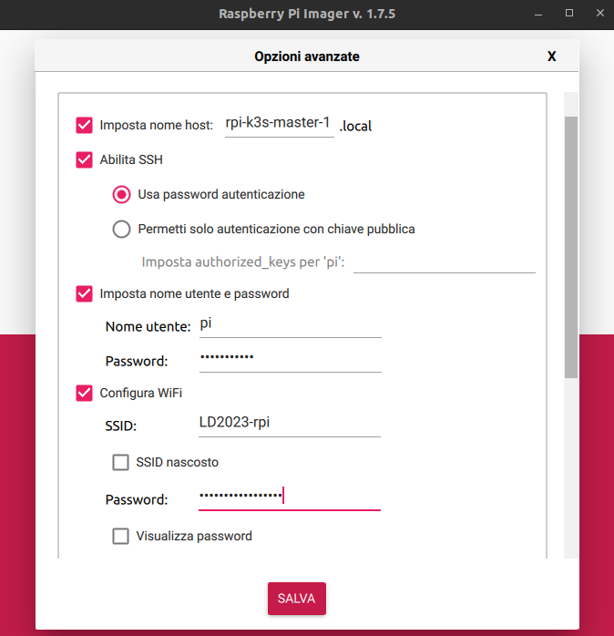
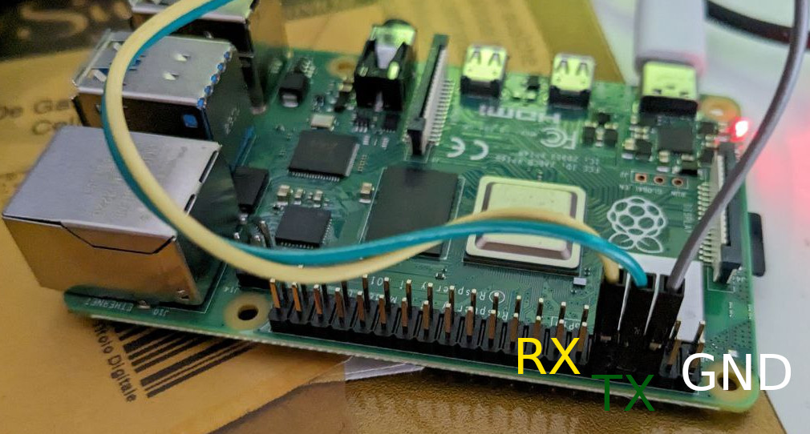

# Raspberry Pi Setup

The easiest way to prepare a Raspberry Pi is using `Raspberry Pi Imager` that can be downloaded [here](https://www.raspberrypi.com/software/).

Run the imager then select the OS and the target SD card. In this case we'll pick `Raspberry Pi OS Lite (64 bit)` image that can be found in the `(other)` section.

Before proceed writing go to the advanced options page clicking on the wheel icon. Remember to:

- Set the hostname of the board
- Enable SSH
- Configure WiFi network (SSID and password)

Please note that the **best choice** would be to use a wired connection through the ethernet cable and setup a static IP address for each RPI that you are going to use. Anyway the network settings can be changed in a second moment.

Now you can write the image to the SD card.

Enable the serial debug editing `config.txt` and adding `enable_uart=1` at the bottom.

If you have a USB serial connector connect the wires like showed in this picture

